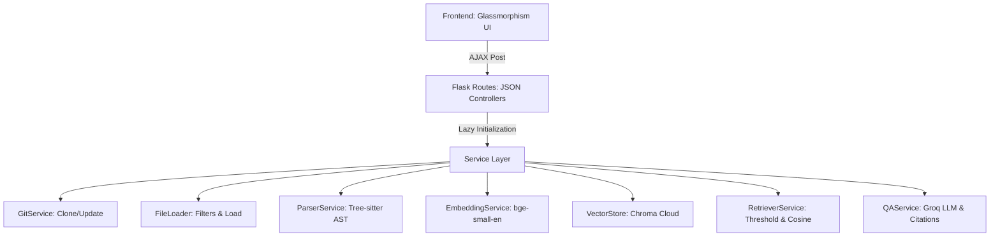

# NexAura QA — Advanced Codebase Search Engine

An advanced, production-grade Codebase QA search engine that allows users to ask natural language questions over a GitHub repository and receive precise, verified answers with exact line citations.

## System Architecture & Features

This application implements a professional service-oriented architecture:



1. **Backend Routing & Validation**: Uses Flask Blueprints. Requests are validated via Pydantic schemas. 
2. **CENTRALIZED Exception Handling**: Centralized error handlers log raw technical tracebacks internally while returning clean, user-friendly JSON payloads to the frontend.
3. **Advanced AST Chunking**: Leverages Tree-sitter to parse Python, JS, and TS, chunking code by function, method, and class definitions. Long nodes are split sequentially by line limits, and any code outside of definitions is indexed as context blocks to guarantee 100% codebase coverage.
4. **Chroma Cloud Integration**: Uses a multi-tenant Cloud database to index vectors and perform cosine similarity matching with score thresholding.
5. **Hallucination Prevention**: Groq prompt rules restrict answers strictly to the retrieved context, falling back to a standardized "not found" response if information is missing.

---

## Technical Stack

- **Backend**: Flask
- **Frontend**: HTML5, Vanilla CSS, JS (Lucide Icons, Poppins/Inter Google Fonts)
- **Vector Database**: Chroma Cloud
- **LLM Engine**: Groq API (Llama-3.3-70B)
- **AST Parsing**: Tree-sitter (Python, JS, TS, TSX)
- **Embeddings**: Sentence Transformers (`BAAI/bge-small-en-v1.5`)
- **Git Operations**: GitPython
- **Validation**: Pydantic (v2)

---

## Installation & Setup

### 1. Prerequisites
- Python 3.12 or 3.13
- Git installed on your system path
- Virtual env (e.g., managed via `uv` or standard Python `venv`)

### 2. Install Dependencies
Initialize your virtual environment and install the package list:
```bash
pip install -r requirements.txt
```

### 3. Environment Configuration
Create a `.env` file at the root of the project using the `.env.example` template:
```env
# Groq API Configuration
GROQ_API_KEY=gsk_your_groq_api_key_here

# Chroma Cloud Database Configuration
CHROMA_API_KEY=ck_your_chroma_api_key_here
CHROMA_TENANT=your_tenant_id_here
CHROMA_DATABASE=RAG
```

---

## Running the Application

To launch the web application, run:
```bash
python run.py
```
This runs the Flask development server on: [http://127.0.0.1:5000](http://127.0.0.1:5000)

---

## Testing & Verification

### 1. Unit Tests
Run the Python test runner to verify core calculations (AST chunking, language detectors, and Git naming):
```bash
python -m unittest discover -s tests
```

### 2. Manual Verification Walkthrough
1. **Open the Webpage**: Go to `http://127.0.0.1:5000`. You will see the luxury glassmorphism UI.
2. **Index a Repo**: Enter a public repository.
   - **Sample Repository**: `https://github.com/octocat/Spoon-Knife`
   - Click **Index Repository**. A skeleton state and a progressive loader will display.
   - On success, a toast message will notify you and reveal metrics cards (e.g., files parsed and chunks indexed).
3. **Ask a Question**:
   - **Sample Question 1**: `What does the index.html file contain?`
   - **Sample Question 2**: `How is the code structured or what function does it have?`
   - Click **Generate Answer**. A purple loader spinner will activate.
   - The response will render in a clear markdown format.
   - Exact source citations will appear at the bottom. Click any citation to expand and inspect the highlighted source code range.
4. **Copy Controls**: Click **Copy Answer** or **Copy Citation** to copy content directly to your clipboard.
